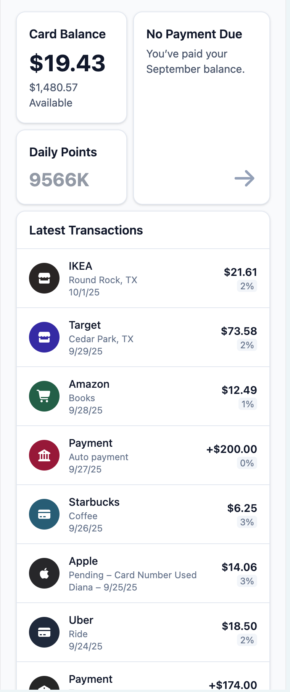
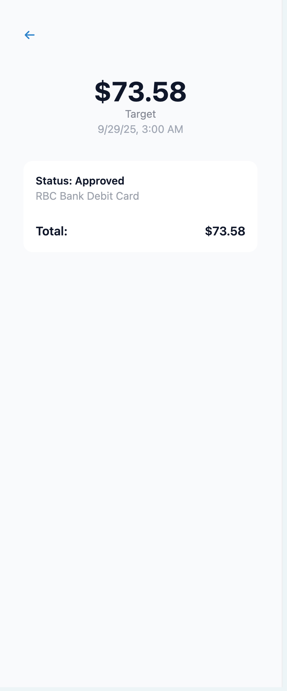

# test task

A minimal React + TypeScript app scaffolded with Vite and tuned for mobile-only view.

- Package/folder name: `test-task` (NPM packages can't contain spaces)
- App title/display name: "test task"

## 📱 Screenshots



### Transaction Detail



## Mobile-only behavior

- Viewport is set for mobile devices.
- When the viewport width is greater than 768px, the app displays a blocker message asking you to resize or use a mobile device.
- On mobile widths (≤ 768px), the app renders inside a constrained container (max-width ~428px) centered on the page.

## Scripts

- `npm run dev` — start the dev server
- `npm run build` — type-check and build for production
- `npm run preview` — preview the production build
- `npm run typecheck` — run TypeScript checks only

## Getting started

1. Install dependencies
   ```bash
   npm install
   ```
2. Start the dev server
   ```bash
   npm run dev
   ```
3. Open http://localhost:5173 and resize to ≤768px to see the mobile UI.

## Notes

- If you prefer Yarn or PNPM, you can swap npm commands accordingly.
- This setup uses Vite with the React SWC plugin for fast refresh and builds.
